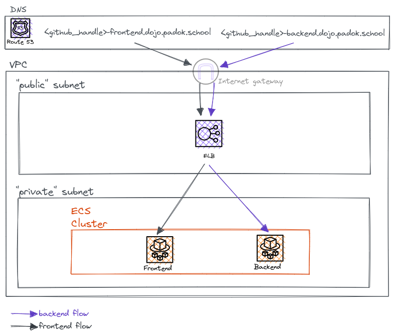

# Dojo Terraform

In this dojo, you will learn Terraform basics, how to use the language and how to organize your codebase to make it easly understandable and maintanable.

For the purpose of the dojo we will deploy a classic AWS infrastructure to expose a mini website on Internet. In order to make it simplier for you, we already set up some parts of the infrastructure and you have a dedicated Virtual Machine with all the tools and rights you need.


**Target Infrastructure**



---

## Usefull documentation

This documentation could be useful for the dojo. Don't be afraid to ask questions and search on internet too.

- [Terraform documentation](https://www.terraform.io/)
- [Tfswitch](https://tfswitch.warrensbox.com/Install/)
- [AWS Terraform provider](https://registry.terraform.io/providers/hashicorp/aws/latest)
- [Visual Studio Code](https://code.visualstudio.com/)

## Step 0 - I set up my toolbox

**Technical Comments**

- Download & install [Visual Studio Code](https://code.visualstudio.com/download)
- Install [`Remote - SSH`](https://marketplace.visualstudio.com/items?itemName=ms-vscode-remote.remote-ssh) extension for VSCode
- Make sure you have declared your ssh key in your github account (cf [the documentation](https://docs.github.com/fr/authentication/connecting-to-github-with-ssh/adding-a-new-ssh-key-to-your-github-account))
- Connect through `ssh-remote` with `<github_handle>@<github_handle>.dojo.padok.school`
- Go to `/home/<github_handle>/dojo-terraform` in the Virtual Machine
- Use `tfswitch` command to install the accurate terraform version
- Explore your repository!! :D
- Type your first `terraform` CLI command to show the current version in use

<details>
  <summary> Hint n°1</summary>
  Tfswitch will use `.tfswitchrc` file in your repository...
</details>

<details>
  <summary> Hint n°2</summary>
  Have you  read the Getting Started `terraform` documentation?
</details>

<br>

**Acceptance Criterias**

- [ ] I have [Visual Studio Code](https://code.visualstudio.com/) installed with Remote - SSH extension installed
- [ ] I can connect to my remote VM at `<github_handle>@<github_handle>.dojo.padok.school`
- [ ] I can open the repository [dojo-terraform](https://github.com/padok-team/dojo-terraform) on VS Code
- [ ] I can show my installed terraform version

Know that you are all set up,you are ready to deploy your application with Terraform on an AWS infrastructure!

<details>
  <summary> What did you learn? </summary>
  <ul>
    <li>Use tfswitch to change your terraform version</li>
    <li>Terraform CLI can be used in your console</li>
    <li>(optional) - VSCode is awsome </li>
  </ul>
</details>

<br>

## Step 1 - I Have DNS records for my application

In this exercise, you will deploy a DNS record to make a public endpoint for your future web application.
We will have two endpoints:
- `<github_handle>-frontend.dojo.padok.school`
- `<github_handle>-backend.dojo.padok.school`

In the meantime you will learn how to make a basic configuration for terraform.

### A - I can deploy a terraform resource

**Technical Comments**

Provder configuration:
- In [`app/`](./app), create a `_settings.tf` file
- Based on [AWS provider documentation](https://registry.terraform.io/providers/hashicorp/aws/latest/docs), configure `terraform` and `provider` blocks with
  - `>= 4.0.0` required provider version
  - `eu-west-3` region
  - `default_tags`
    - ManagedByTF = "true"
    - User = "<github_handle>"

DNS:

- Create a file `dns.tf` and use the resource [`aws_route53_record`](https://registry.terraform.io/providers/hashicorp/aws/latest/docs/resources/route53_record)
- The endpoint name is `<github_handle>-app.dojo.padok.school`. For now we will only have one endpoint (app) instead of two (frontend and backend).
- Zone ID and record list are given by your professor
- This is CNAME record

Deployment:
- Using your `terraform` CLI in VSCode console and based on [Terraform documentation](https://developer.hashicorp.com/terraform)
- Init your terraform configuration using `terraform init`
- You should see on you terminal "Terraform has been successfully innitialized!"
- Deploy your configuration
- See your DNS record in AWS Console in Route 53 > Hosted zones - `dojo.padok.school`
- Take a look at the `.tfstate` file created on your `app` folder

<details>
  <summary> Hint n°1</summary>
  Have you seen the `Use Provider` toggle on the documentation?
</details>

<details>
  <summary> Hint n°2</summary>
  Have you take a look at the aws_route53_record resource documentation? It seems like some parameters are required...
</details>

<details>
  <summary> Hint n°3</summary>
  Maybe try a `terraform init`, `terraform plan`, `terraform apply` commands?
</details>

### Acceptance Criterias
- [ ] I have a DNS record `<github_handle>-app.dojo.padok.school` in my DNS Hosted Zone
- [ ] I can make a `terraform apply` on my `app` folder
- [ ] I have a local terraform `state` with all my deployed resources described in it

<br>
At this point, your `terraform` configuration is set and you can deploy new resources and change existing ones. But some informations are hardcoded in your code, what do you think of that?


### B - I keep my codebase DRY

**Technical Comments**

Data:

- Based on [AWS provider documentation](https://registry.terraform.io/providers/hashicorp/aws/latest), use a [aws_route53_zone](https://registry.terraform.io/providers/hashicorp/aws/latest/docs/data-sources/route53_zone) data to refer an existing hosted zone named `dojo.padok.school`. The route is not private.
- Do the same for an `aws_lb` resource named "padok-dojo-lb" to get the dns name of the load balancer.
- Refer those data in your record resource. The attributes `zone_id` and `records` of your route 53 record should not be hardcoded anymore, but should use data references.

<details>
  <summary> Hint n°1</summary>
  Be careful! `resources` and `data` are not the same but they are refered with the same name!
</details>

<details>
  <summary> Hint n°2</summary>
  Resources & Data blocks expose some outputs you can use.
</details>


Locals:

- Create a new file `locals.tf` and check [how locals are declared in terraform](https://developer.hashicorp.com/terraform/language/values/locals)
- Add a new local `applications` that is a map of empty object named "frontend" and "backend"
- Iterate on this map to create two distinct records
  - `<github_handle>-frontend.dojo.padok.school`
  - `<github_handle>-backend.dojo.padok.school`
- Re-deploy your infrastructure. Your Terraform plan will destroy some resources, that's not a problem.

<details>
  <summary> Hint n°3</summary>
  To iterate over maps, you can use the [for_each](https://developer.hashicorp.com/terraform/language/meta-arguments/for_each) expression.
</details>


**Acceptance Criterias**
- [ ] My terraform code does not have external resources hardecoded configuration
- [ ] I have two DNS records for
  - `<github_handle>-frontend.dojo.padok.school`
  - `<github_handle>-backend.dojo.padok.school`
  and the code for these resources is unique


At this point, you deployed two dns records for your application, each one pointing on the same Elastic Load Balancer instance.
Now let's deploy our web application! :D

<details>
  <summary> What did you learn? </summary>
  <ul>
    <li>Configure a terraform provider</li>
    <li>Deploy a resource</li>
    <li>Destroy a resource</li>
    <li>Use data to get remote resoures informations</li>
    <li>Use locals to avoid repetition in code</li>
    <li>Iterate on your resources</li>
  </ul>
</details>


## Step 2 - I deploy my application

### A - My load balancer can target my instances

We want to confgiure our Load Balancer to target your application instances, based on their endpoint.

**Technical Comments**

**LB target groups**

- Based on the [official documentation](https://registry.terraform.io/providers/hashicorp/aws/latest/docs/resources/lb_target_group) and the following template
- Set the accurate configuration to deploy two `aws_lb_target_group` using iteration
- Frontend application runs on port 80 and backend on port 3000
- Useful informations are in `~/data.txt`
- Deploy your resources


```yaml
resource "aws_lb_target_group" "this" {
  # TODO: iterate to create 2 target groups
  name        = "<github-handle>-<app>" #TOFILL
  port        = ""                      #TOFILL
  protocol    = "HTTP"
  target_type = "ip"
  vpc_id      = "" #TOFILL

  health_check {
    enabled             = true
    interval            = 30
    timeout             = 5
    healthy_threshold   = 5
    unhealthy_threshold = 2
    matcher             = "200"
    path                = "/"
    port                = "traffic-port"
    protocol            = "HTTP"
  }
}
```

<details>
  <summary> Hint n°1</summary>
  You may re-use the  application local already declared.
</details>


<br/>

**LB listener rules**
- Based on the [official documentation](https://registry.terraform.io/providers/hashicorp/aws/latest/docs/resources/lb_listener_rule) and the following template
- Set the accurate configuration to deploy two `aws_lb_listener_rule` using iteration
- Useful informations are in `~/data.txt`
- Deploy your resources

```yaml
resource "aws_lb_listener_rule" "this" {
  # TODO: iterate to create 2 target groups
  listener_arn = "" #TOFILL
  action {
    type             = "forward"
    target_group_arn = "" #TOFILL
  }
  condition {
    host_header {
      values = [<my-endpoint-value>] #TOFILL
    }
  }

  lifecycle {
    ignore_changes = [
      priority
    ]
  }
}
```


<details>
  <summary> Hint n°1</summary>
  You may re-use the  application local already declared.
</details>

<details>
  <summary> Hint n°2</summary>
  Feel free to update your existing codebase to avoid code repetition
</details>

<br/>

**Acceptance Criterias**
- [ ] I have a target group for my backend and my frontend
- [ ] My load balancer has new listener rules pointing on the right target groups

<br/>

### B - I use a module to deploy resources

**Technical Comments**

- Use [official documentation](https://developer.hashicorp.com/terraform/language/modules/syntax) to get familiar with the usage of a module
- Take a look at the service module in [`modules/service`](modules/service)
- See what variables are necessary for the module to work
- Instanciate the module by creating a terraform file in [`app/`](./app). The source can be a relative path to your module.
- You need to deploy two services: frontend and backend
- Set the proper variables for your module
- Useful informations are in `~/data.txt`
- Deploy your resources

<details>
  <summary> Hint n°1</summary>
  You may use a data to get ECS cluster details. Its name is padok-dojo.
</details>

<details>
  <summary> Hint n°2</summary>
  You might need some outputs from previously created resources to use for the module variables.
</details>

<details>
  <summary> Hint n°3</summary>
  You can reuse the locals created previously to iterate over the module and create the two services.
</details>


**Acceptance Criterias**
- [ ] My backend endpoint shows the expected data
- [ ] My frontend endpoints shows a terraform image and congratulates me for my great work 🥳


### C - I have my own module for my application

- créer un module
- variabiliser

## Step 3 - To go further

### A - Terraform CLI

### B - See Limits of terraform
